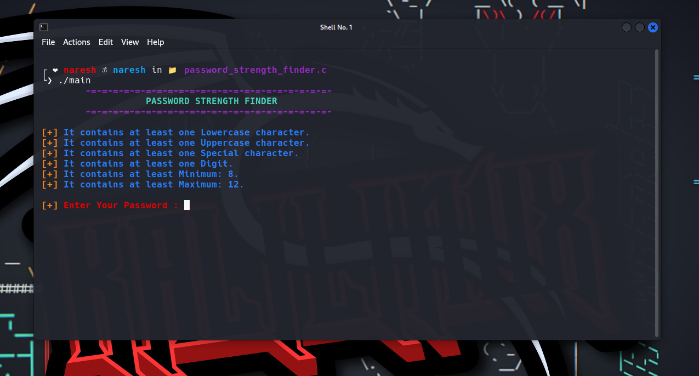

<p align=center>



<p align='center'>This Tool Developed By <br> <a herf="https://www.instagram.com/the_naresh_offcial/">@thenareshofficial</p>

## A password strength finder can help you create stronger passwords that are harder to crack by brute force attacks or gusseing...


## Installation

```console

#clone the repo
$git clone https://github.com/theNareshofficial/Password_strength_finder.c.git

#change Directory Bomb.py
$cd Password_strength_finder.c

#compile
$gcc main.c -o main

#Executable file
$./main

```


<h1 align='center'><u>ThankYou</u></h1>
